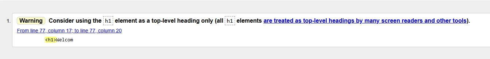
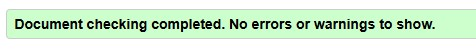
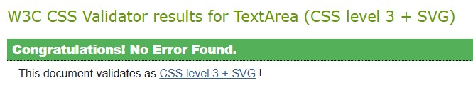

# Mental Health | Charles Tack

## Code Institute - Individual Formative Assignment

### HTML/CSS Essentials - User Centric, Static Front-End Website

[Click Here to view the Live Project.](https://charlestack.github.io/mentalhealth/)

[Click here to view the Repository.](https://github.com/CharlesTack/mentalhealth)

## Table of Contents:

- [The Why](https://github.com/CharlesTack/mentalhealth#the-why)
- [(UX) User Experience](https://github.com/CharlesTack/mentalhealth#ux-user-experience)

- [Design](https://github.com/CharlesTack/mentalhealth#design)

  - [Design Brief](https://github.com/CharlesTack/mentalhealth#design-brief)
  - [Typography](https://github.com/CharlesTack/mentalhealth#typography)
  - [Colours](https://github.com/CharlesTack/mentalhealth#colours)
  - [Images](https://github.com/CharlesTack/mentalhealth#images)
  - [Wireframes](https://github.com/CharlesTack/mentalhealth#wireframes)
    - [Mobile](https://github.com/CharlesTack/mentalhealth#mobile)
    - [Tablet](https://github.com/CharlesTack/mentalhealth#tablet)
    - [Desktop](https://github.com/CharlesTack/mentalhealth#desktop)

- [Technologies](https://github.com/CharlesTack/mentalhealth#technologies)
- [Testing](https://github.com/CharlesTack/mentalhealth#testing)
- [Deployment](https://github.com/CharlesTack/mentalhealth#deployment)
- [Credits](https://github.com/CharlesTack/mentalhealth#credits)

## The Why:

Provide accessible, beginner-friendly information on mental health including how to recognize common issues and manage stress, presented in a supportive and organised layout.

## (UX) User Experience:

Users are likely to have an interest in mental health conditions, but as they may be experiencing mental health difficulties the design of the site should be logical and flowing, free from frustration, and use a colour scheme which promotes calmness.  Anything which may be triggering should be subtle in imagery, and the language used should be positive and supportive.

- ### The User

  - #### A visitor struggling with their mental health:
    - To receive information on how to identify symptoms.
    - To receive tips and advice on how to manage and improve mental health.
    - To be calmed and reassured.
  - #### The parent/friend/carer of someone struggling with mental health difficulties:
    - To help recognise the symptoms of a selection of mental health conditions.
    - To find a curated selection of local mental health organisations for further support.
  - #### Anyone experiencing or caring for someone experiencing a mental health crisis:
    - To find information on where to receive emergency assistance.
    - To not be further triggered by any content.
    - To be calmed by the colour scheme.

### Future ideas:

- Implement a section of positive affirmation messages for regular visitors to refer to.
- Add ability to email positive messages to self.
- Increase contrast between colours for greater accessibility.
- Add section for mental health careers.

## Design:

### Design Brief:

The purpose of the Mental Health website is to provide information which is easy to read, logically ordered, and presented in a calming manner.  Bootstrap cards have been selected and used for their familiarity to the average user, and the colour scheme should be calming whilst also maintaining good contrast for ease of visibility.  As the most popular device for web browsing, the site was designed to be mobile-first, and responsive to look as good on a variety of device types and sizes.

### Typography:

The typography should be easy to read, and calming to the eye.  With this in mind a script style (Paprika) has been selected for headings to appear less formal, and a sans-serif font (Noto) has been selected for its legibility on a range of device sizes.  Both fonts were taken from the Google Fonts library.

### Colours:

The colour scheme for the site was decided upon using assistance from AI (Leonardo AI Image Generator).  AI was used to create the hero image using a prompt which requested a calming image featuring a person feeling relaxed and peaceful with their eyes closed, with a background which reflected nature with lush greens.  From the AI image, a pipette tool was used via imagecolorpicker.com to select colours which complemented each other, whilst maintaining good contrast and having a calming feel.  These colours were then applied via CSS variables to allow for ease of selection for different elements.

Background colour: #fbf5d8 - cornsilk
Primary colour: #668755 - reseda green
Secondary colour: #97b76a - olivine
Tertiary colour: #4a3b3a - van dyke
Highlight colour: #aabfda - powder blue
Highlight colour (light): #537c74 - hooker's green

### Images:

Images in the hero section and in the "symptoms" and "tips" cards were AI generated.

Leonardo.ai was used for the hero image.

"Symptoms" card images:
Copilot was used for the "low-mood" image.
Photoshop AI was used for the "anxiety-square" image.
ChatGPT was used for the "isolation" and "stress" images.

Tips card images:
For inspiration for the AI image prompts, the NHS "Every Mind Matters" site was used.  A selection of the images on https://www.nhs.uk/every-mind-matters/mental-wellbeing-tips/top-tips-to-improve-your-mental-wellbeing/ were described to Copilot for images to be generated from.

Favicon.io was used for the logo and browser tab images.

The external site images were logos obtained via a Google image search and adjusted in Photoshop to use the same image size.

The emergency section images (with the exception of the Samaritans logo) were created in Photoshop with the aim of using calming background colours from the colour scheme and non-triggering images. 

### Content:

Page content was written by Charles Tack with some assistance from Copilot and elements curated from other sources referenced in the credits section.

### Wireframes:

The basic structure of the site was sketched out on the Noteshelf app and then with the use of the software [BALSAMIQ](https://balsamiq.com/) the sketches were converted into a more professional and realistic looking guide.
During development, there were tweaks to the wireframes which were recorded via version progression (v1.0 through to v1.2).  Images of the v1.3 version are below and original Balsamiq files are included in the directory.

#### Mobile:

- [index.html](assets/images/wireframes/mobile-index.jpg)
- [help.html](assets/images/wireframes/mobile-help.jpg)
- [message-modal](assets/images/wireframes/mobile-modal.jpg)

#### Tablet:

- [index.html](assets/images/wireframes/tablet-index.jpg)
- [help.html](assets/images/wireframes/tablet-help.jpg)
- [message-modal](assets/images/wireframes/tablet-modal.jpg)

#### Desktop:

- [index.html](assets/images/wireframes/desktop-index.jpg)
- [help.html](assets/images/wireframes/desktop-help.jpg)
- [message-modal](assets/images/wireframes/desktop-modal.jpg)

## Technologies:

### Languages used:

- [HTML](https://en.wikipedia.org/wiki/HTML5)
- [CSS](https://en.wikipedia.org/wiki/CSS)
- [MARKDOWN](https://en.wikipedia.org/wiki/Markdown)

### AI usage:

Copilot in VS Code was used extensively to assist and accelerate code generation in both HTML and CSS.
Copliot was also used to debug issues such as highlighting why buttons were not aligning with text in the same section.  Prompts used were clear and concise to reach the required objectives, though there were occasions where Copilot was unable to successfully fix bugs (for instance the navbar scrolling issue mentioned in [Bugs & Fixes](https://github.com/charlestack/mentalhealth#bugs--fixes)).

Copilot was also consulted on performance improvement and optimisation, and a list of 12 points for improvements were provided, although many would be impractical (such as "Improve Server Response Time").  Certain other suggestions were very valid and could be used to further improve this project and for future projects (such as using the WebP format for images).

AI tools were also used in image creation as mentioned in [Images](https://github.com/CharlesTack/mentalhealth#images).

As a general reflection on the use of AI on this project, it has been a source of frustration (for example when trying to get AI tools to create images which look like they've been produced by the same artist) and a source of tremendous benefit in the time saved when coding manually.  AI tools should be used in moderation.  I felt that I would have been better to code manually at times to help with personally debugging issues, rather than relying on Copilot to debug itself.

## Testing:

For testing multiple resources were used:

1. [W3 Markup Validation Service](https://validator.w3.org/)
2. [W3 CSS Validation Service](https://jigsaw.w3.org/css-validator/)
3. [Chrome Dev Tools - Lighthouse](https://developers.google.com/web/tools/lighthouse/)
4. Manual Testing
5. [WebAIM Contrast Checker](https://webaim.org/resources/contrastchecker/)

Using the above resources I have tested all individual pages and noted all bugs found in [Bugs & Fixes] (https://github.com/charlestack/mentalhealth#bugs--fixes).
I have also used peer review for a "fresh set of eyes" to help pick out any issues I may have missed.

The site has been manually tested on the following devices:
- Samsung Galaxy S20 FE
- Samsung Galaxy Tab S8
- Apple iPad (10th Gen)
- HP Elite Dragonfly 13" Laptop
- PC Specialist Gaming Desktop with MSI Ultra Widescreen monitor at 2560 x 1080

The site has also been tested on the following browsers:
- Google Chrome
- Microsoft Edge
- Apple Safari
- Mozilla Firefox
- Opera

### Testing Results:

W3 validation testing was carried out and a number of errors were highlighted which have been fixed, please see [Bugs & Fixes](https://github.com/charlestack/mentalhealth#bugs--fixes) for details.

W3 validation completed as clear of any errors or warnings, except for the warning regarding the h1 element on line 77 of index.html which was maintained as the appearance of the h1 element marks the true stylistic start of the page (with the preceding h2 element being in the hero section).

The W3 CSS validation did present 10 warnings, but as these are in respect of the usage of variables and imported style sheets (i.e. Bootstrap) they can be ignored.

Images of pass & warning messages below and full page images stored in the directory.

- W3 index.html Result:

- W3 help.html Result:

- W3 CSS Result:

### Lighthouse Results:

- index.html
  - [Desktop](assets/images/lighthouse/lh-desktop-index.jpg)
  - [Mobile](assets/images/lighthouse/lh-mobile-index.jpg)
- help.html
  - [Desktop](assets/images/lighthouse/lh-desktop-help.jpg)
  - [Mobile](assets/images/lighthouse/lh-mobile-help.jpg)

Tabulated:
- Mobile:

| Page       | Performance | Accessibility | Best Practices | SEO |
| ---------- | ----------- | ------------- | -------------- | --- |
| index.html | 80          | 94            | 96             | 100 |
| help.html  | 94          | 98            | 96             | 100 |

- Desktop:

| Page       | Performance | Accessibility | Best Practices | SEO |
| ---------- | ----------- | ------------- | -------------- | --- |
| index.html | 97          | 89            | 100            | 100 |
| help.html  | 99          | 93            | 100            | 100 |

The Lighthouse advice was to reduce image file sizes by using modern file types, such as WebP, which will be considered for site updates as well as future projects. 

### Bugs & Fixes:

- Send message doesn't deliver user to success page as success page hasn't been created. _not fixed_
- Auto-scrolling to sections on index.html from the navbar links didn't result in the right area being scrolled to.  Identified that the height of the un-collapsed menu was causing the issue and need to JavaScript to use a time-out instruction needed. _fixed_
- Navbar wouldn't auto collapse in mobile view. _fixed_

Initial W3 validation yielded the following errors:

index.html:
- The element button must not appear as a descendant of the a element.  From line 42, column 29; to line 42, column 62. _fixed_
- No p element in scope but a p end tag seen.  From line 83, column 17; to line 83, column 20. _fixed_
- The element button must not appear as a descendant of the a element.  From line 113, column 17; to line 113, column 50. _fixed_
- End tag div seen, but there were open elements.  From line 187, column 25; to line 187, column 30. _fixed_
- Unclosed element ul.  From line 182, column 29; to line 182, column 32. _fixed_
- Section lacks heading. Consider using h2-h6 elements to add identifying headings to all sections, or else use a div element instead for any cases where no heading is needed.  From line 272, column 9; to line 272, column 63. _fixed_
- The element button must not appear as a descendant of the a element.  From line 311, column 29; to line 311, column 62. _fixed_
- The element button must not appear as a descendant of the a element.  From line 320, column 29; to line 320, column 62. _fixed_
- The element button must not appear as a descendant of the a element.  From line 329, column 29; to line 329, column 62. _fixed_
- The element button must not appear as a descendant of the a element.  From line 338, column 29; to line 338, column 62. _fixed_
- The aria-labelledby attribute must point to an element in the same document.  From line 372, column 5; to line 372, column 118. _fixed_
- (Warning) Consider using the h1 element as a top-level heading only (all h1 elements are treated as top-level headings by many screen readers and other tools).  From line 77, column 17; to line 77, column 20. _not fixed_

help.html:
- No p element in scope but a p end tag seen.  From line 80, column 17; to line 80, column 20. _fixed_

CSS:
3 Errors
- .footer : Value Error : color var is not a color value : var. _fixed_
- .footer : Parse Error (--tertiary-color). _fixed_
- .footer : Parse Error }. _fixed_

### Manual Testing:

- Manual testing was carried out on local and deployed sites using a variety of devices and browsers (see earlier in this section).

| Location   | Feature                           | Expected Outcome                                                                                      | Pass/Fail | Notes                 |
| ---------- | --------------------------------- | ----------------------------------------------------------------------------------------------------- | --------- | --------------------- |
| Nav Bar    | Logo, Website name and Home link  | Takes user to the home page from which ever screen they're on                                         | Pass      | Functions as expected |
| Nav Bar    | Emergency Button                  | Takes user to the help.html page                                                                      | Pass      | Functions as expected |
| Nav Bar    | Symptoms, Tips and External links | Takes user to the appropriate sections of the home page                                               | Pass      | Functions as expected |
| Main       | Message Yourself Button           | Pops modal form to send message to yourself                                                           | Pass      | Functions as expected |
| Modal Form | Form elements and Send button     | Form elements take input and the placeholder text is replaced. Send button returns user to home page. | Pass      | Functions as expected |
| Main       | Carousel                          | Carousel rotates automatically and can be manually controlled with arrows.                            | Pass      | Functions as expected |
| Main       | External links                    | Buttons labelled "Visit Site" take you to the respective external sites.                              | Pass      | Functions as expected |
| Footer     | Social media links                | Social media default sites are opened when links are clicked.                                         | Pass      | Functions as expected |

### WebAIM Testing:

The colours used on the site in combination with each other have been analysed by the [WebAIM](https://webaim.org/resources/contrastchecker/) contrast checker which provided the following results (a score out of 5 to display how many of their tests each combination passed, as well as the contrast ratio):

- Brown (#4A3B3A) on blue (#AABFDA): 4/5 (contrast ratio: 5.64:1)
- Yellow (#FBF5D8) on dark green (#537C74): 2/5 (contrast ratio: 4.25:1)
- Brown (#4A3B3A) on green (#97B76A): 4/5 (contrast ratio: 4.7:1)
- Green (#668755) on yellow (#FBF5D8): 2/5 (contrast ratio: 3.71:1)
- Brown (#4A3B3A) on yellow (#FBF5D8): 5/5 (contrast ratio: 9.68:1)
- Brown (#4A3B3A) on white (#FFFFFF): 5/5 (contrast ratio: 10.61:1)
- Green (#668755) on white (#FFFFFF): 2/5 (contrast ratio: 4.06:1)

This would indicate that whilst the colour combinations may be calming, they are not necessarily best used together for accessibility, though it should be noted that the lowest scored combinations are used where the text is either a header or bold.

## Deployment:

### Deployment to GitHub Pages

1. Visit [Github](www.github.com).
2. Navigate to the [charlestack/mentalhealth](https://github.com/CharlesTack/mentalhealth) repository.
3. Click settings along the top options bar.
4. Click pages found at the bottom of the left hand navigation bar.
5. In the 'Source' section, click the dropdown menu that is labelled 'none' and select "Main".
6. Click Save.
7. Page will auto refresh and provide you with a link to the Live GitHub Page for this repository.

The Page can sometimes take a little time to load and go live and this is expected.

### Forking Mental Health Repository

If you wish to experiment with the code freely, you can achieve this by forking the repository. Forking a repository allows you to experiment without the original project being effected. To achieve this you need to:

1. Navigate to the repository [charlestack/mentalhealth](https://github.com/CharlesTack/mentalhealth).
2. In the top right of the page, below your profile you should see a "Fork" button. Simply click on this.
3. A copy of the repository will then be added to your own Repositories Page.

## Credits:

1. [NHS Every Mind Matters](https://www.nhs.uk/every-mind-matters/mental-wellbeing-tips/top-tips-to-improve-your-mental-wellbeing/) - Text content for "tips" card, and inspiration for images.
2. [NHS Mental Health Website](https://www.nhs.uk/mental-health/feelings-symptoms-behaviours/feelings-and-symptoms/) - Source for information on symptoms.
